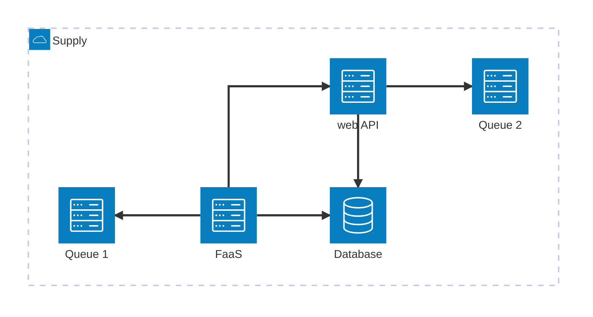

---
# You can also start simply with 'default'
theme: default
# random image from a curated Unsplash collection by Anthony
# like them? see https://unsplash.com/collections/94734566/slidev
background: wallpaper.png
# some information about your slides (markdown enabled)
title: OTL - 101
titleTemplate: "%s"
# apply unocss classes to the current slide
class: text-center
# https://sli.dev/features/drawing
drawings:
  persist: false
# slide transition: https://sli.dev/guide/animations.html#slide-transitions
transition: fade-out
# enable MDC Syntax: https://sli.dev/features/mdc
mdc: true
---

# Observability & Telemetry 101

<div class="text-size-xl">Key Principles</div>

---
transition: slide-left
layout: two-cols-header
---

# What are Our Responsibilities?

As **engineers** we

<div mb-15 text-center>

<v-clicks every="1">

💡design💡

🔧build🔧

🔄improve🔄

🛠️maintain systems🛠️
</v-clicks>

<v-clicks>

For internal and external users
</v-clicks>
</div>

::left::

<v-clicks>

**To ease our work for  
such responsibilities..**
</v-clicks>

::right::

<v-clicks>

.. we need to understand  
**how our system behaves on a daily basis**.

We need **observable** systems. 👀
</v-clicks>

<SlideCurrentNo position="absolute" bottom="0" right="2"/>
---
layout: image-right
image: observability.jpg
transition: slide-up
---

# What is Observability?

"Ability to **understand the internal state** of a system by **examining its outputs**."

<div mt-25>
<v-clicks every="1">

Observability is a <span v-mark.green="1">property</span> of a system.

A system **has to be made observable**, it is quite not by default.

So we have to instrument it with **telemetry.**
</v-clicks>
</div>

<SlideCurrentNo position="absolute" bottom="0" left="2"/>
---
transition: fade-out
---

# What is Telemetry?

_**"tele"**_ far, _**"metron"**_ measure  
Ability to collect data about a system.

<v-click>

For this we need to define for our systems:
</v-click>
<v-clicks>

1. What ***type*** of data to collect
2. What ***type*** of data for ***which*** usage
3. What ***data*** to collect
4. How to ***measure*** the data
5. How to ***collect*** it
</v-clicks>

<SlideCurrentNo position="absolute" bottom="0" right="2"/>
---
layout: section
transition: slide-up
---

# What ***type*** of data to collect?

<SlideCurrentNo position="absolute" bottom="0" right="2"/>
---
transition: slide-up
layout: two-cols
---

# Logs

A recording of an event.

<v-clicks>

Logs are **readable**, timestamped text records  
*with optional metadata ℹ️*

They may be <span v-mark.red="2">unstructured</span>, flat

or <span v-mark.green="3">structured</span> to enable **parsing, processing**.
</v-clicks>

::right::

<v-clicks at="2">

<div mt="5">
```
[ERROR] 2024-08-04 12:45:23 - Failed to connect to database. Exception: java.sql.SQLException: Timeout expired. Attempted reconnect 3 times. Server: db.example.com, Port: 5432
System reboot initiated at 2024-08-04 03:00:00 by user: admin. Reason: Scheduled maintenance. Services stopped: web-server, database, cache. Estimated downtime: 15 minutes.
DEBUG - 2024-08-04 09:30:15 - User johndoe performed action: file_upload. Filename: report_Q3_2024.pdf, Size: 2.3 MB, Duration: 5.2 seconds. Result: Success
```

</div>
</v-clicks>

<v-clicks at="3">

<div mt="5">
```json
{
  "timestamp": "2024-08-04T12:34:56.789Z",
  "level": "INFO",
  "service": "user-authentication",
  "environment": "production",
  "message": "User login successful",
  "duration": 200,
  "request": {
    "method": "POST",
    "url": "/api/v1/login",
    }
  },
  "response": {
    "statusCode": 200,
    "body": {
      "success": true,
    }
  }
}
```
</div>
</v-clicks>

<SlideCurrentNo position="absolute" bottom="0" right="2"/>

<!--
log: journal
logging: journalisation

technically, it is a log entry, or event record, log is a misnomer
-->
---
transition: slide-up
layout: two-cols
---

# Metrics

A measurement captured at runtime.

<v-clicks>

**Metric**: Measurement of a thing

**Metric event**: Point in time measurement  
*with optional metadata ℹ️*

<div mt-10>

Three main types:
</div>

**Observer/Gauge**:  
Measure of a value at given time (number+unit)

**Counter**: Accumulating value over time

**Measure/Histogram**:  
Captures distribution of values
</v-clicks>

::right::

<v-click at="4">

- `CPU usage`: 52%
- `Queue length`: 156 pending messages
- `Disk remaining space`: 12.53GB
- `connected users to the app`: 4 933 users
<arrow x1="390" y1="300" x2="490" y2="170" color="#953" width="2" arrowSize="1" />
</v-click>

<v-click at="5">
<div mt-10>

- `HTTP requests`: 590 requests
- `Cache hits`: 133 006 hits
- `Users login count`: 10 344 logins
- `Orders in a day`: 5 324 orders
</div>
<arrow x1="400" y1="370" x2="485" y2="310" color="#953" width="2" arrowSize="1" />
</v-click>

<div mt-10 v-click="[6,9]">

- `Endpoint response time`
- `Database query executing time`
- `Item search response time`
</div>
<arrow v-click="6" x1="310" y1="430" x2="485" y2="410" color="#953" width="2" arrowSize="1" />


<SlideCurrentNo position="absolute" bottom="0" right="2"/>
---
transition: slide-up
---

# Logs and metrics, isn't that enough?

Observability in a fragmented system.

<v-clicks>

Our systems are composed of multiple **sub-systems** (FaaS, web services, databases, queues, *etc*)
</v-clicks>

<div v-click ml-0 scale-90 translate-y="-10">



</div>

<SlideCurrentNo position="absolute" bottom="0" right="2"/>
---
transition: fade-out
layout: two-cols-header
---

# Traces

The path of a request through your application.

<v-clicks>

A trace is an aggregation of linked period of time (**spans**).  

```mermaid
gantt
    title Distributed Trace
    dateFormat x
    axisFormat %S.%L

    section TRACE
    full trace                 :crit, 0, 450ms
    section BFF
    HTTP GET /order            :span_1, 0, 250ms
    section Stock
    HTTP POST /process-order   :done, 30, 80ms
    section Transport
    HTTP GET /pickup           :done, 110, 130ms
    section FaaS Worker
    Consume Message           :done, 350, 100ms
```

It shows <span v-mark.green="2">causal and temporal</span> relationship between services involved in a request.
</v-clicks>

<v-click at="1">


</v-click>

::left::

<v-click at="3">
<div m-2>

```json5{all|all|3|4|5|all}
// Span context
{
  "span_id": span_id,
  "trace_id": trace_id,
  "parent_id"?: parent_span_id
}
```
</div>
</v-click>
::right::

<v-click at="7">
<div m-2>

```json5{all|3|4-6}
// and more
{
  "metadata": {..}, // ℹ️
  "events": [
    { event1, event2, ..}
  ]
}
```
</div>
</v-click>

<SlideCurrentNo position="absolute" bottom="0" right="2"/>

<!--
to span: couvrir, traverser
a span: une travée, une étendue, une intervalle
-->
---
layout: fact
transition: slide-left
---

# Logs Metrics Traces

## The Three Pillars of Observability

<SlideCurrentNo position="absolute" bottom="0" right="2"/>
---
layout: section
transition: slide-up
---
# ()
# Metadata, indexing and performances

Dimensions - Cardinality


<SlideCurrentNo position="absolute" bottom="0" right="2"/>
---
layout: two-cols
transition: slide-up
---

# What is a **dimension**?

<v-clicks>

a set  
a property, a metadata

<div flex flex-col items-end self-end>

- <span v-mark.orange="8">`asset_id`</span>
- <span v-mark.orange="8">`severity`</span>
- <span v-mark.orange="8">`HTTP method`</span>
- <span v-mark.orange="8">`user_id`</span>
- <span v-mark.orange="8">`environment`</span>
</div>
</v-clicks>


<div mt-5>
<v-clicks at="6">

## What about the total cardinality?

$\text{\small \textbf{Cardinality}} = \prod_{i=1}^{n} \text{\small Dimension's Cardinality}_i$

</v-clicks>

<v-click at="10">

### `8*3*4*200*4` = **76800** 
</v-click>

</div>
::right::

<v-clicks>

# What is a **cardinality**?

number of elements in a set  
all possible values for a property

- <span v-mark.circle.green="9">**8**</span> possible assets
- `INFO`, `WARN`, `ERROR` <span v-mark.circle.green="9">(**3**)</span>
- `POST`, `GET`, `PATCH`, `PUT` <span v-mark.circle.green="9">(**4**)</span>
- <span v-mark.circle.green="9">**200**</span> users
- `dev`, `terone`, `integ`, `prod` <span v-mark.circle.green="9">(**4**)</span>
</v-clicks>

<v-click at="11">
<div mt-20 border-3 p-3>

#### Cardinalities may varies from $10^5$ to $10^9$ in distributed systems.
</div>
</v-click>


<SlideCurrentNo position="absolute" bottom="0" right="2"/>
---

# Why bother?

**high dimensions** allow <span v-mark.green="1">precise and thorough</span> analysis and troubleshooting, we want them!

<v-clicks at="2" every="1" depth="2">

- dimensions are **indexed** to allow querying for analysis, troubleshooting, etc.
- ➡️ high dimension **induces high cardinality**
- ➡️ high cardinality induces **larger indices**
- ➡️ larger indices are **costly to maintain and use**
- costs are
  - **computational costs** (it is long to re-index and **may be** long to request ⏳⏳)
  - **financial costs** (We pay for *Dynatrace* **compute usage**, including indexing and querying 💸💸)
</v-clicks>

<v-click at="9">

<div mt-10 border-2 border-red-300 text-center p-3>

### We **MUST** be careful with which dimension we declare.
</div>
</v-click>

<SlideCurrentNo position="absolute" bottom="0" right="2"/>
---
layout: quote
class: text-center
transition: slide-up
---

## Okay, we understand observability and how to enable it through telemetry.

<div mt-10>

## But for what usage?
</div>

<SlideCurrentNo position="absolute" bottom="0" right="2"/>
---
layout: two-cols
transition: slide-up
---

# Monitoring, Alerting and Debugging

Leveraging **observability** to its true potential.

<v-click>

Usual way to proceed:
</v-click>

<v-clicks every="1">

1. We observe the system
2. We detect a problem
3. We work our way out to resolve it
</v-clicks>
::right::
<v-click>

# Translation


What does it really mean
</v-click>

<v-clicks every="1" depth="2" mt-14>

1. We <span v-mark.green="6">**monitor**</span> our system by collecting <span v-mark.green="6">**telemetry**</span> <span v-mark.green="6">**data**</span> as our system is <span v-mark.green="6">**observable**</span>.
2. We alert when things go bad using
    1. <span v-mark.green="8">**Automatic alerting**</span> on top of collected telemetry, enabled by observability backend 🚀
    2. <span v-mark.green="9">**Manual alerting**</span>, we look at graphs and numbers with our little eyes 👀
3. We <span v-mark.green="10">**debug**</span> our systems helped by telemetry data to drive us through the fog of war
</v-clicks>

<SlideCurrentNo position="absolute" bottom="0" right="2"/>
---
layout: two-cols
---

# Alerting, which tool?

How to detect efficiently

<v-clicks pr-5 every="1" mb-3>

### <span v-mark="{ at: 8, color: '#60a7fa', type: 'highlight', iterations: 1, animationDuration: 450 }">Metrics</span>

- metrics are (*somehow*) frugal to compute
- they are very expressive to monitor a system as a whole
- there is a **plenty of ways** to define alerting based on them
</v-clicks>

<v-click>

#### **Gaussian-like datasets**

means, standard deviation, percentiles, ..
</v-click>
<v-click>

#### **Non-gaussian datasets**

fast fourier transformation (FFT), linear regression, smoothing, Kolmogorov-Smirnov, ..
</v-click>

::right::

<v-click>

# Debugging, which tool?

How to dive down into the rabbit hole
</v-click>

<div mt-10 v-click>

### <span v-mark="{ at: 8, color: '#60a7fa', type: 'highlight', iterations: 1, animationDuration: 450 }">Traces</span>

They enable the big picture, which link in the chain is weak, <span v-mark.green="6">**where to look at**</span>
</div>
<div mt-10 v-click>

### <span v-mark="{ at: 8, color: '#60a7fa', type: 'highlight', iterations: 1, animationDuration: 450 }">Logs</span>

Deeper look into what is going on, <span v-mark.green="7">**to dive in**</span>
</div>

<SlideCurrentNo position="absolute" bottom="0" right="2"/>
<!--
FFT: Detect recurring patterns, transform time-series into frequencies
Linear regression: Detect trends and trends changes
-->
---
layout: quote
class: text-center
transition: slide-up
---

# Precisely, what data to collect?

Let's dive into what we want to measure
<SlideCurrentNo position="absolute" bottom="0" right="2"/>
---
transition: slide-up
---

# **Metrics**: Application-oriented

Sensors for app, OS, database, network traffic, hardware usage, etc

<v-click>

### 🏅 4 golden signals 🏅
</v-click>

<div mt-5 text-4>

<v-clicks every="1">

- **Latency**: Time it takes to service a request.  
<span v-click="6">Measure/Histogram in $\text{ms}$</span>
- **Traffic**: How much demand is being placed on the system.  
<span v-click="7">Measure/Histogram in $\text{req}/\text{s}$ for a REST API, $\text{i/o}$ for a database</span>
- **Saturation**: How "full" a service is.  
<span v-click="8">Observer/Gauge in $\text{\%}$</span>
- **Errors**: Rate of requests that fail.  
<span v-click="9">Measure/Histogram in $\text{req/s}$</span>
</v-clicks>
</div>

<div v-click="10" bold text-center border mt-5 border-red-300 p-2>

#### "If you measure all four golden signals\[...\],  your service will be at least decently covered by monitoring." - **Google SRE**
</div>

<SlideCurrentNo position="absolute" bottom="0" right="2"/>
---
transition: slide-up
layout: image-right
image: business-metrics.jpg
---

# **Metrics**: Business-oriented

Signals about your business, your users and their behaviors
<v-click>

- Order type. <span v-click="3">➡️ Metric counter</span>
- Carriers pick up. <span v-click="3">➡️ Metric counter</span>
- order size. <span v-click="3">➡️ Metric counter</span>
- *and so on..*
</v-click>

<v-click>

It may allow:
- churn rate
- A/B testing
- business decisions..
</v-click>

<SlideCurrentNo position="absolute" bottom="0" left="2"/>

<!--
churn rate: taux de désistement
-->
---
transition: slide-up
layout: two-cols-header
---

# **Traces**

*High-level* and *In-depth* analysis for distributed systems

<v-click>

We want to have the **most complete view** and path requests take in our application.  
If the request go through 5 REST APIs and 3 FaaS, we want spans for <span v-mark="{at: 2, color: '#fca5a5', type: 'highlight', iterations: 1, animationDuration: 450}">*(quite)* all underlying components</span>. 🤓
</v-click>
<v-click at="3">

But, what if we generate a huge amount of traces? Like more than 1 000 per seconds?
</v-click>

::left::

<v-click at="4">

#### **Head Sampling**
</v-click>

<v-clicks at="5">

- When a trace is created, Deterministic Sampling
- 👍 Efficient
- 👍 Easier to configure
- 👍 May be done at any point
- 👎 Not possible to ensure that all error traces are sampled

</v-clicks>

::right::

<v-click at="10">

  #### **Tail Sampling**
</v-click>

<v-clicks at="11">

- When a trace is received, done by Observability backend
- 👍 Always sample a trace with an error
- 👍 Sampling based on overall latency
- 👍 Sampling based on specific dimensions values
- 👎 More difficult to implement
- 👎 May induce more costs (financial and computational)
</v-clicks>

<SlideCurrentNo position="absolute" bottom="0" right="2"/>
---

# **Logs**, for breaking cases

Details, details, details

### Rules of thumb

<v-clicks every="1">

- Structured, always
- Choose the correct level (💸 and ⏳)
- Meaningful log messages in english
- Add context (dimensions)
- Don't log sensitive information (like env variables)
</v-clicks>

<div text-center mt-15 v-click>

## We're good to go!
</div>

<SlideCurrentNo position="absolute" bottom="0" right="2"/>
---
layout: section
transition: fade-out
---

# How to **measure** the data

How to instrument **easily** our systems
<SlideCurrentNo position="absolute" bottom="0" right="2"/>
---
layout: end
---

# To be continued
